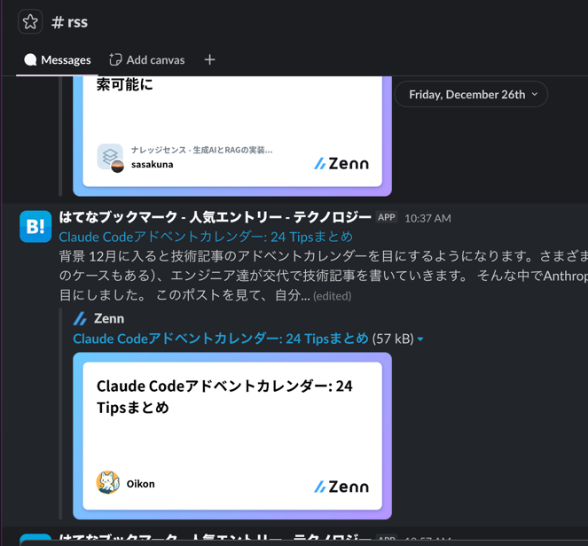
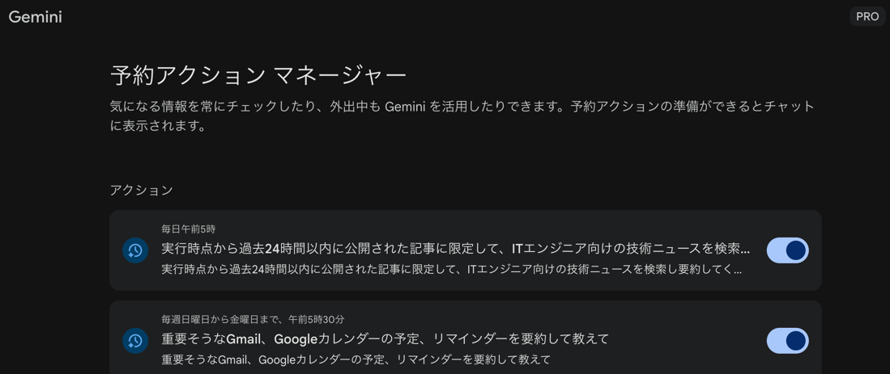
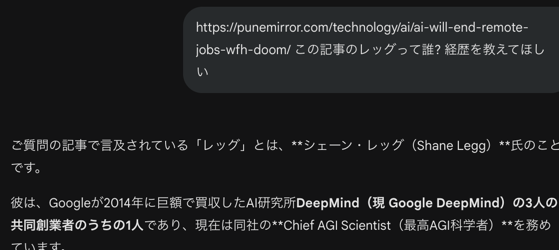

# はじめに

エンジニアの情報収集、うまくいってますか？

「技術トレンドをキャッチアップしなきゃ」と思いつつ、気づけばXをダラダラ眺めて時間だけが過ぎていく。そんな経験はありませんか？

私もそうでした。この記事では、**Geminiの「予約アクション」を使って、毎朝の技術ニュースインプットを完全に自動化した話**をします。

# 私が試した情報収集の変遷

## Xをダラダラ見る時代

最初は多くのエンジニアと同じく、Xで技術情報を追っていました。

### 問題点

- ノイズが多すぎる（炎上、ポエム、広告...）
- 気づいたら1時間経ってる
- 結局何をインプットしたか覚えていない

## Slack RSS時代

次に試したのが、SlackにRSSフィードを流し込
む方法。Zenn、Qiita、はてなブックマーク、PublicKeyなどを登録し、朝に流し読みして気になった記事をXに投稿する運用にしました。



### 改善した点

- ノイズは減った
- 「投稿する」という行動でインプットの証跡が残る

### 残った課題

- 情報ソースが日本語圏に偏る
- 海外の最新動向が追いづらい
- ソフトスキルや業界動向系の記事が弱い
- 結局、毎朝Slackを開いて読む「意志の力」が必要

# 解決策：Gemini「予約アクション」

## 予約アクションとは？

**指定した日時に、決まったプロンプトをGeminiに自動実行させる**機能です。

実行結果はスマホに通知が届くので、「Geminiを開く」という行動すら不要。



## 私が設定したプロンプト

最初はシンプルなプロンプトから始めました。

```text
毎日JST 5:00 amに、ITエンジニアが知っておくべき技術ニュースを要約して教えて
```

しかし、使っているうちに「古い記事が混ざる」「日本語記事に偏る」「元記事のURLがほしい」といった不満が出てきました。

そこで**Geminiに「〇〇してほしい」と伝えるだけで、プロンプトを自分好みに改善**できます。設定画面をいじる必要はなく、会話の中で自然にチューニングできるのが予約アクションの強みです。

最終的に落ち着いたプロンプトがこちらです。

```text
実行時点から過去24時間以内に公開された記事に限定して、ITエンジニア向けの技術ニュースを検索し要約してください。
技術トレンドだけでなく、エンジニアのソフトスキル、組織開発、EMやPO向けのトピックも含めてください。
各ニュースには必ず参照元のURLを記載してください。
また、私の過去の会話履歴や好みを考慮し、関心が高そうな順に並べて提示してください。
```

**毎日午前5時**に実行するよう設定しています。

# 使ってみて変わったこと

## Before

- 朝起きる → Slackを開く → 記事を探す → 読む（やる気が必要）
- 情報源が限定的で、視野が狭くなりがち

## After

- 朝起きる → iPhoneの通知をタップ → 要約を読む（やる気不要）
- 世界中の技術トレンドが30秒で把握できる
- 気になれば、そのままGeminiとの会話で深堀りできる


# 深堀りもできる

予約アクションの強みは、**配信されたニュースをそのまま深堀りできる**ことです。



気になった記事があれば、そのまま「この人誰？」「もっと詳しく」と聞くだけ。**ニュースの表面だけでなく、文脈まで理解できる**のが、単なるRSSリーダーとの決定的な違いです。

実際の会話履歴はこちらで公開しています：
https://gemini.google.com/share/4cc44d42712b

# まとめ

- 習慣化のコツは「やる気」に頼らないこと
- Geminiの予約アクションで、仕事が忙しくても毎朝勝手にインプットが積み重なる
- プロンプトは使いながら改善すればOK
- 設定は5分で完了

ぜひ試してみてください。

以上。
